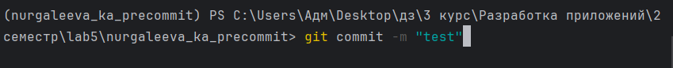
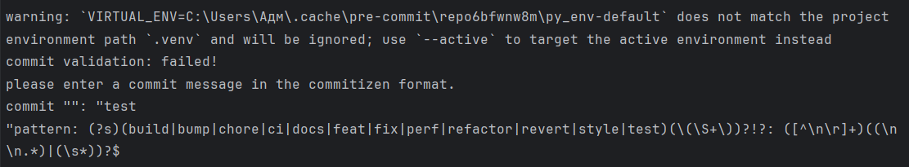
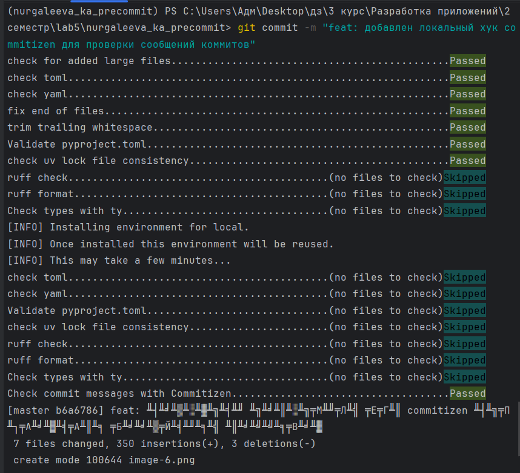
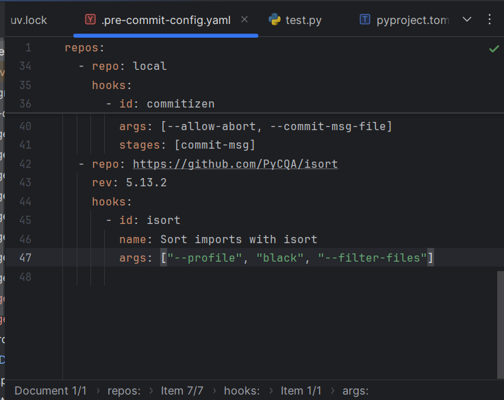
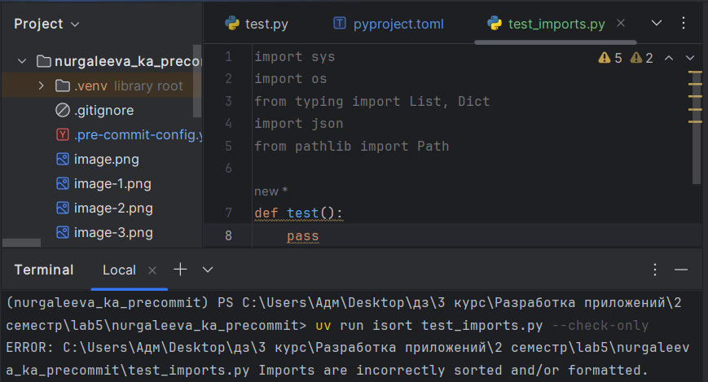
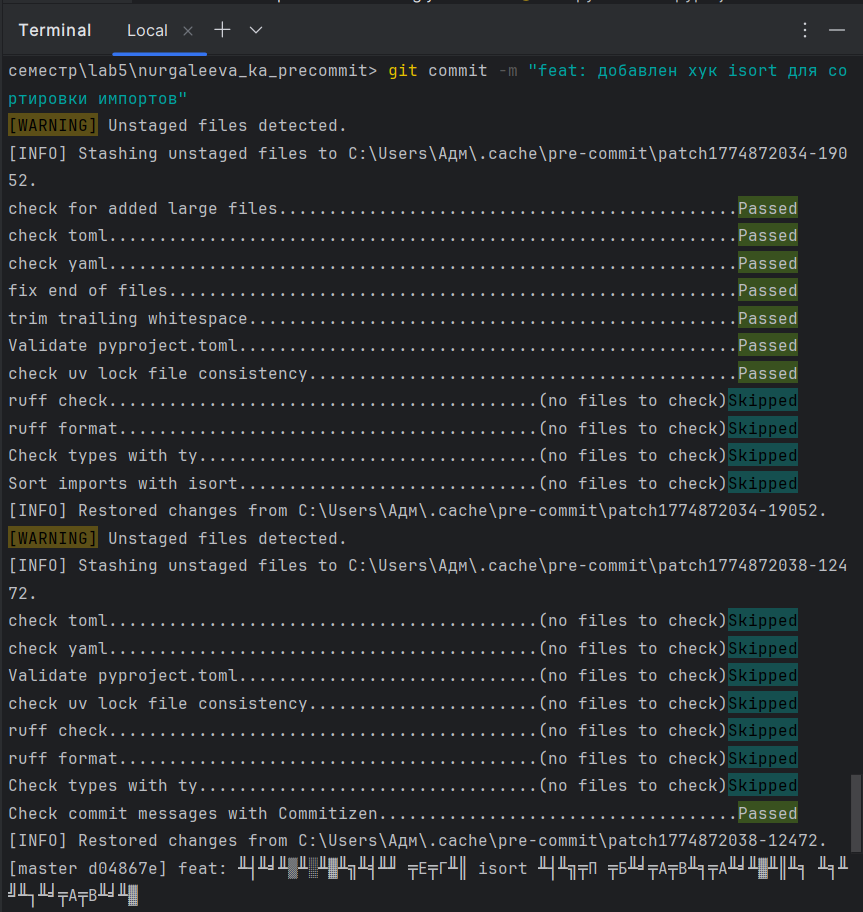
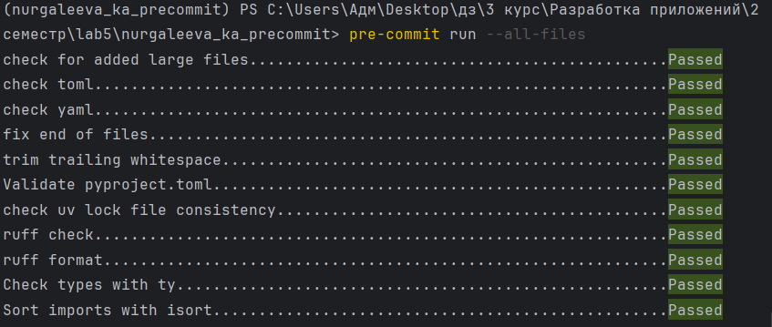

# Лабораторная работа №5
## Автоматизация проверки кода с pre-commit

**Студент:** Нургалеева К.А.
**Группа:** МОА-231

---

## Краткое описание pre-commit и его преимуществ

**Pre-commit** — это мощный фреймворк для управления и выполнения pre-commit хуков. Он позволяет автоматически проверять код на соответствие стандартам, форматировать его и находить ошибки до того, как они попадут в репозиторий.

---

## 📋 Список использованных хуков
- check-added-large-files
- check-toml
- check-yaml
- end-of-file-fixer
- trailing-whitespace
- validate-pyproject
- uv-lock
- ruff-check
- ruff-format
- ty-check
- commitizen
- isort

---

### 1. Подготовительный этап: создание проекта и первого коммита.


---

### 2. Добавление доплнительных удаленных репозиториев.
- Выполнение всех хуков

- Проверка ruff хуков, выдает ошибку, потому что тестовый файл был некорректным


---

### 3. Локальные хуки: проверка типов и сообщений коммитов.
- 3.1 Хук для проверки типов с помощью ty
Хук вывел ошибку, потому что ожидал получить int, а получил str


- 3.2 Хук для проверки сообщений коммитов с Commitizen




---
### 4. Добавить свой собственный локальный хук.
- Хук для сортировки импортов в алфавитном порядке (isort)
Добавила хук isort в .pre-commit-config.yaml

Проверила работу хука на тестовом файле, вывел ошибку, так и должно быть

Сделала коммит


---

### 5. Финальная проверка и отчёт.
Все хуки работают


---

## Инструкция по установке и использованию

### Требования

- Python 3.8 или выше
- uv (менеджер пакетов)
- Git

### Клонирование репозитория

```bash
git clone
cd nurgaleeva_ka_precommit
